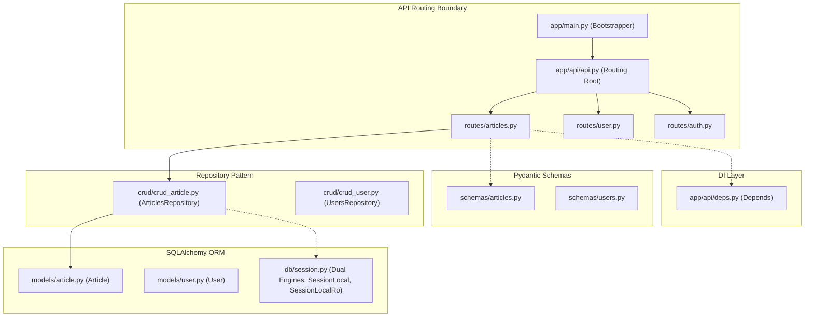

# System Map and Reading Order

This module maps out the application's physical architecture, ownership layers, boundary points, and recommended code-reading paths, followed by a domain glossary outlining essential terms and potential JS-to-Python naming mismatches.

---

## 🗺️ Architectural Topology

This is a single-service asynchronous API. It isolates network interfaces (HTTP endpoints) from business actions and database operations.

---

## 📂 Codebase Ownership Layer Table

The codebase is logically segregated into functional layers:

| Layer | Directories / Core Files | Primary Purpose | TS/JS Equivalent |
|---|---|---|---|
| **API Entry & Middleware** | `app/main.py`, `app/api/` | HTTP request routing, CORS configuration, API route grouping, and endpoint decorators. | Express Router / NestJS Controllers |
| **Dependency Injection** | `app/api/deps.py` | Asynchronously resolves DB connections, splits write/read replications, and handles JWT auth verification. | NestJS Providers / Passport Middleware |
| **Data Validation** | `app/schemas/` | Validates, sanitizes, and serializes request bodies and response JSON structures. | Zod / class-validator / io-ts |
| **Persistence (CRUD)** | `app/crud/` | Encapsulates ORM query construction, filters, transactional writes, and batch joins. | Prisma Service / TypeORM Custom Repositories |
| **Database Models** | `app/models/` | Sets up table mappings, foreign key references, indexes, and relationship lazy-loading. | TypeORM Entities / Prisma Schema models |
| **Database Connection** | `app/db/session.py` | Configures connection engines and establishes session factories. | PrismaClient instantiation |
| **Migrations** | `alembic/`, `alembic.ini` | Declares database schema versions and schema change operations. | Prisma Migrate / Knex Migrations |

---

## 🚪 Public vs. Private Boundaries

1.  **Public Boundary (HTTP Handlers):** Everything under `app/api/routes/` is a public HTTP interface. These files are forbidden from running raw SQL. They must speak exclusively in **Pydantic schemas** and delegate operations to Repository classes.
2.  **Private Boundary (Database Access):** Classes under `app/crud/` handle database actions. They are forbidden from raising HTTP exceptions or parsing HTTP headers directly. They interact with SQLAlchemy models and return raw records or tuples.

---

## 📚 Curriculum Reading Paths

To build a structured understanding, read the files in these paths depending on your experience:

### 1. The Junior Walk (CRUD basics)
1.  [app/schemas/base.py](file:///c:/Users/Owner/Desktop/rewritepy2js/fastapi-realworld-example-app/app/schemas/base.py) — Understand camelCase key conversions.
2.  [app/api/routes/tags.py](file:///c:/Users/Owner/Desktop/rewritepy2js/fastapi-realworld-example-app/app/api/routes/tags.py) — See a simple read list operation.
3.  [app/crud/crud_user.py](file:///c:/Users/Owner/Desktop/rewritepy2js/fastapi-realworld-example-app/app/crud/crud_user.py#L24-L34) — Check how basic user records are saved.

### 2. The Mid-Level Path (Validation, DI, and Relations)
1.  [app/api/deps.py](file:///c:/Users/Owner/Desktop/rewritepy2js/fastapi-realworld-example-app/app/api/deps.py) — Learn how database sessions and credentials are injected into controllers.
2.  [app/models/user.py](file:///c:/Users/Owner/Desktop/rewritepy2js/fastapi-realworld-example-app/app/models/user.py) — Trace user entity mappings and self-referential follower joints.
3.  [app/crud/crud_comment.py](file:///c:/Users/Owner/Desktop/rewritepy2js/fastapi-realworld-example-app/app/crud/crud_comment.py) — Inspect nested comments retrieval.

### 3. The Senior Staff Path (Transactions and Concurrency)
1.  [app/db/session.py](file:///c:/Users/Owner/Desktop/rewritepy2js/fastapi-realworld-example-app/app/db/session.py) — Analyze how write and read-only engines are isolated.
2.  [app/crud/crud_article.py:82](file:///c:/Users/Owner/Desktop/rewritepy2js/fastapi-realworld-example-app/app/crud/crud_article.py#L82) — Review how `get_paginated_list` aggregates article records and count queries in parallel using `asyncio.gather`.
3.  `alembic/env.py` — Analyze how migrations are run within async connection loops.

---

## 📖 Domain Glossary

*   **Repository (`app/crud/`):** The layer that acts as an in-memory collection of domain models. It hides SQL database logic.
*   **Dependency Injection (`Depends`):** FastAPI's mechanism to declare parameters that are resolved automatically before endpoint execution.
*   **Pydantic Model (`app/schemas/`):** A validation and serialization class. (Similar to a Zod schema).
*   **Session (`AsyncSession`):** A transactional database connection wrapper that tracks changes to ORM models.
*   **Alembic (`alembic.ini`):** A lightweight database migration tool for SQLAlchemy.

### ⚠️ Terms a JS Developer Will Misread

1.  **"Module" (Python):** In JS, a module is typically a single `.js/.ts` file. In Python, a "module" is any `.py` file, but a folder containing an `__init__.py` file is a **Package**.
2.  **"App" (Python):** In Express, `app = express()` is the global HTTP router. In FastAPI, `app = FastAPI()` is the same. However, Python developers with a Django background often use "app" to refer to a self-contained feature subfolder (e.g., "the users app"). Here, features are organized by layers inside a single application module structure, not isolated Django-style apps.
3.  **"Schema" (Python vs. JS):** In JS databases (like Mongoose/Prisma), "schema" refers to the physical database structure. In Pydantic, a "Schema" is purely an **API Request/Response Data Transfer Object (DTO)**, not the physical database layout.
4.  **"Decorators" (Python vs. TS):** In TS, decorators (e.g., `@Controller()`) are experimental metadata tags compiled to functions. In Python, a decorator (e.g., `@router.post()`) is a standard, highly performant runtime wrapper function that immediately wraps and registers the underlying target function.
