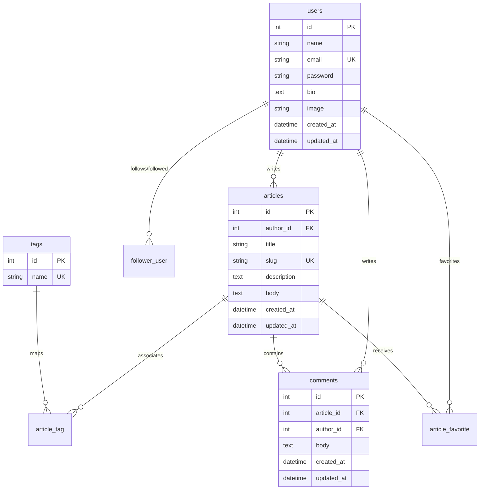

# Data, Auth, and Side-Effects Architecture

This module details the relational database schema, Alembic migration systems, security validations, authorization models, and transaction management patterns.

---

## 🗄️ Relational Database Schema & Indexes

Based on the actual migration configuration in [alembic/versions/29b2b20b29d7_.py](file:///c:/Users/Owner/Desktop/rewritepy2js/fastapi-realworld-example-app/alembic/versions/29b2b20b29d7_.py), the relational layout is structured as follows:



### 🔑 Critical Keys & Indices
1.  **Uniqueness Constraints:** 
    *   `ix_users_email` (unique index on `users(email)`) protects against duplicate accounts.
    *   `ix_articles_slug` (unique index on `articles(slug)`) ensures clean, unique URL slugs.
    *   `ix_tags_name` (unique index on `tags(name)`) prevents duplicate tag tags in the database.
2.  **Cascade Deletions:** Association tables (`article_tag`, `article_favorite`) enforce `ondelete="CASCADE"` on their foreign keys. If an article is deleted, PostgreSQL automatically purges its associated records from junction tables.

---

## 🔄 Transaction Boundaries & Schema Evolution

### Dual-Database Isolation
As traced in the [Articles Feed Request Flow](file:///c:/Users/Owner/Desktop/rewritepy2js/fastapi-realworld-example-app/docs/upskill/02-request-flows/02-secondary-flow-deep-dive.md), the system isolates write sessions (`SessionLocal`) from read-only replica sessions (`SessionLocalRo`).
*   **Write Transactions:** Instantiated in controllers via dependencies. The session scope starts when the endpoint is triggered and commits via `await self.db.commit()`.
*   **Read-Only Transactions:** Session contexts bypass table locking completely, conserving write replica connections.

### 📋 Checklist: How to Change a Schema Safely in Production
To add a new column (e.g. `read_time_minutes: Integer`) to the `articles` table in a live environment without incurring API downtime:

1.  **Step 1: Declare the property in the Model**
    Add the property to the SQLAlchemy model class in [app/models/article.py](file:///c:/Users/Owner/Desktop/rewritepy2js/fastapi-realworld-example-app/app/models/article.py). Set `nullable=True` (or define a default value) so existing records do not break.
2.  **Step 2: Generate the Migration Script**
    Run the autogenerate command:
    ```powershell
    # Autogenerates a new python migration version in alembic/versions/ [INFERRED]
    alembic revision --autogenerate -m "add read time to articles"
    ```
3.  **Step 3: Review the Migration Script**
    Open the generated migration file and verify that the `upgrade()` and `downgrade()` steps are fully correct.
4.  **Step 4: Execute Schema Upgrade Pre-Deployment**
    In the CD pipeline, run the database migrations **before** deploying the updated application code:
    ```powershell
    alembic upgrade head
    ```
5.  **Step 5: Deploy Application Code**
    Deploy the new containerized API code that actively utilizes the `read_time_minutes` parameter.

---

## 🛡️ Validation & Auth Security Matrix

The system defends its boundaries using a layered validation and authorization matrix:

| Security Vector | Layer | Implementation File | Purpose / Mechanism |
|---|---|---|---|
| **API Contract Validation** | Validation (Schemas) | `app/schemas/` | Pydantic intercepts payload formats, returning `422 Unprocessable Content` early on type mismatches. |
| **Authentication Guard** | DI Layer | `app/api/deps.py` | Resolves `CurrentUser` parameter. Decodes JWT token; if signature or sub claim is invalid, raises `403 Forbidden`. |
| **IDOR Check (Article Write)** | Controller Layer | `app/api/routes/articles.py` | Enforces ownership before mutating database states. |

### 🚨 In-Depth IDOR (Insecure Direct Object Reference) Protection
Before deleting or updating records, the system explicitly validates that the authenticated requester owns the target resource:

In [app/api/routes/articles.py:126-127](file:///c:/Users/Owner/Desktop/rewritepy2js/fastapi-realworld-example-app/app/api/routes/articles.py#L126-L127):
```python
    if article.author_id != current_user.id:
        raise HTTPException(status_code=status.HTTP_403_FORBIDDEN, detail="You are not author of this article")
```
*Why here?* Deleting an article is a privilege check. Failing to execute this check allows any authenticated user to send a `DELETE /api/articles/123` request and wipe out another user's content (a textbook IDOR security vulnerability).

---

## ⚡ Side-Effects Topology & Transaction Risks

This backend functions as a pure database-driven engine. It does not contain background message queues (like Celery/RabbitMQ), caching engines (like Redis), or third-party email API providers.

### 🚨 Transactional Pitfall: The Blocked Connection Lock
A classic architectural bug is placing slow network side-effects inside database transaction blocks.

*   **The Bug Scenario:** A developer wants to send a "Welcome Email" upon signup. They implement it inside the user create repository block:
    ```python
    # BUG — DO NOT DO THIS IN PRODUCTION
    async def create(self, *, obj_in: NewUser) -> User:
        db_user = User(...)
        self.db.add(db_user)
        
        # 🚨 Dangerous Network Block inside Transaction
        await email_provider.send_welcome_email(db_user.email) 
        
        await self.db.commit()
        return db_user
    ```
*   **The Risk:** If the email API provider experiences latency or takes 5 seconds to reply, the write database session is kept open and locked. Under high traffic, this will exhaust the API connection pool within seconds, locking out all database queries.

### 🛡️ The Resolution: Asynchronous Outbox Pattern
To safely resolve side-effects, enterprise systems isolate database transactions from external IO:
1.  **Write to Transaction:** Write the primary record to the database along with an "Outbox Event" row inside the same transaction block.
2.  **Out-of-Process Worker:** An asynchronous task scheduler (like Celery in Python or BullMQ in Node) polls the outbox table periodically or receives a trigger, processing and retrying the email dispatch out-of-process.
