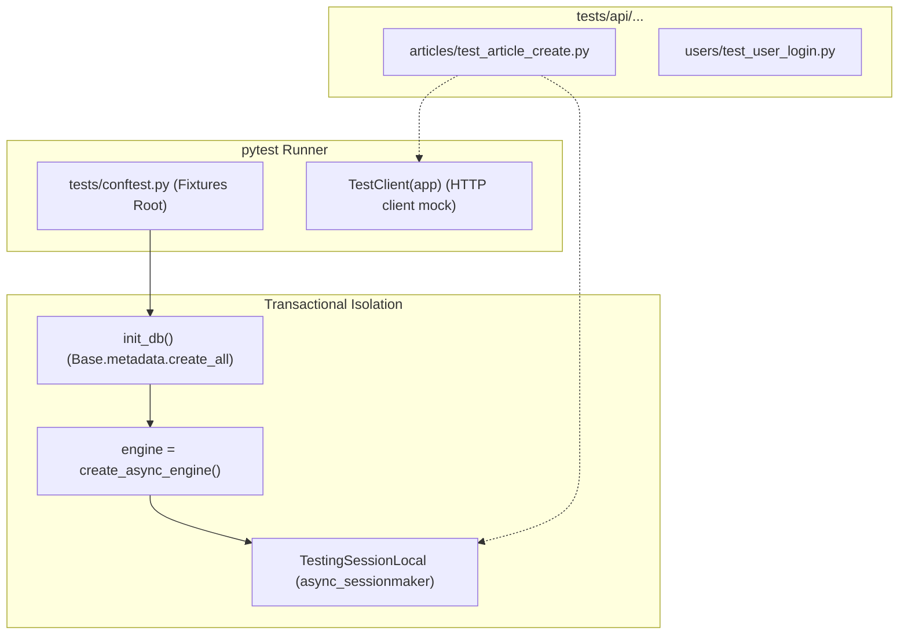

# Quality Assurance: Testing & Debugging Topology

This module details the repository's test execution layer, fixture setup, mock structures, exact test running recipes, and systematic debugging methods.

---

## 🧪 Testing Layer Topology

The test suite is structured around `pytest`, `pytest-asyncio`, and `FastAPI.testclient.TestClient`. It uses a real (or memory-isolated) database instance configured inside the central conftest module.



### 1. Test Isolation & Flake Prevention
*   **Database Cleanup:** In [tests/conftest.py:34-43](file:///c:/Users/Owner/Desktop/rewritepy2js/fastapi-realworld-example-app/tests/conftest.py#L34-L43), the `db` fixture yields an async session to a test function. Once the test completes (whether it passes or fails), the fixture automatically executes SQL `delete()` operations on all tables, committing cleanups before the next test runs, preventing state pollution.
*   **Thread Safety:** The DB session is function-scoped. `pytest-asyncio` is configured with `asyncio_default_fixture_loop_scope = "function"` to ensure every test runs within its own clean asynchronous loop context.

---

## 📋 6 Core pytest Recipes

Below are the exact commands to execute tests in this sandbox:

### 1. Run the Entire Test Suite
```powershell
python -m pytest
```
*   **Bridge Equiv:** `npm test` or `npx vitest run`.

### 2. Run a Specific Test Module
```powershell
python -m pytest tests/api/articles/test_article_create.py
```
*   **Bridge Equiv:** `npx vitest tests/api/articles/test_article_create.spec.ts`.

### 3. Run a Specific Test Function by Name Filter
```powershell
python -m pytest -k "test_can_create_article"
```
*   **Bridge Equiv:** `npx vitest -t "test_can_create_article"`.

### 4. Run Tests and Print Standard Output (`stdout` / print statements)
```powershell
python -m pytest -s
```
*   **Bridge Equiv:** `npx vitest --reporter=verbose` (Standard JS test runners print logs by default).

### 5. Run Test Suite with Statement Coverage Reports
```powershell
python -m pytest --cov=app
```
*   **Bridge Equiv:** `npx vitest --coverage`.

### 6. Fail-Fast (Halt execution immediately on the first failed test)
```powershell
python -m pytest -x
```
*   **Bridge Equiv:** `npx vitest --bail=1`.

---

## 🛠️ Systematic Debugging Scenarios

When a test fails, staff engineers follow a systematic pipeline:
`Reproduce locally` → `Isolate scope` → `Insert runtime intercepts` → `Hypothesize cause` → `Apply fix` → `Verify regression`.

Here are 5 stack-specific scenarios mapped directly to this codebase:

### 🚨 Scenario 1: The Import-Ordering NameError (startup crash)
*   **The Bug:** Running `python -m pytest` yields a crash: `NameError: name 'Article' is not defined` inside `comment.py:26`.
*   **Systematic Isolation:** 
    1.  *Narrow:* The crash happens during `conftest.py` loading, specifically on `from app.models.comment import Comment`.
    2.  *Hypothesize:* Because `Comment` is imported first, and its type definition uses the raw class name `Mapped[Article]`, Python evaluates `Article` before it is imported in `conftest.py` (which imports `Article` on line 19).
    3.  *Fix:* Rearrange the imports in [tests/conftest.py](file:///c:/Users/Owner/Desktop/rewritepy2js/fastapi-realworld-example-app/tests/conftest.py#L10) so `Article` and `User` are imported *before* `Comment`, or add `from __future__ import annotations` to the top of all model files.
*   **Python Tool:** `python -m pytest` output.
*   **Node Equiv:** Node.js circular import compilation failures or runtime `ReferenceError`.

### 🚨 Scenario 2: Lazy Loading Violations during Serialization
*   **The Bug:** An endpoint returns a `500 Server Error` on payload serialization. The logs reveal: `sqlalchemy.exc.MissingGreenlet: greenlet_spawn has not been called`.
*   **Systematic Isolation:** 
    1.  *Narrow:* Accessing relationship records (like `article.author`) outside the async database transaction context.
    2.  *Hypothesize:* The author relation was lazy-loaded by default. Once the database connection closed, Pydantic tried to access `article.author.name` during serialization, trying to fire a synchronous query over an async driver.
    3.  *Fix:* Eagerly load relationships using `.options(joinedload(Article.author))` in the repository query.
*   **Python Tool:** Inserting a `breakpoint()` or `import pdb; pdb.set_trace()` directly inside [app/crud/crud_article.py:45](file:///c:/Users/Owner/Desktop/rewritepy2js/fastapi-realworld-example-app/app/crud/crud_article.py#L45) to inspect relation states.
*   **Node Equiv:** JS `debugger` statements in Node, or inspecting raw Prisma queries when virtual properties are accessed.

### 🚨 Scenario 3: JWT Verification Expiry Errors
*   **The Bug:** Tests pass individually but fail when run in sequence, returning `403 Forbidden` on authenticated endpoints.
*   **Systematic Isolation:** 
    1.  *Narrow:* Check the duration between JWT generation in setup fixtures and actual test execution.
    2.  *Hypothesize:* The token lifetime is too short or hardcoded, resulting in expiry intermediate checks failing in sequential runs.
    3.  *Fix:* In `app/core/security.py`, expand the token expiration offset or mock the system clock in tests using `freezegun` or pytest overrides.
*   **Python Tool:** `pdb` commands (`p payload["exp"]` to print expiration).
*   **Node Equiv:** Jest clock mocking: `jest.useFakeTimers()`.

### 🚨 Scenario 4: Async Loop Collisions (`InvalidRequestError`)
*   **The Bug:** The controller returns `InvalidRequestError: Session is already executing a query`.
*   **Systematic Isolation:** 
    1.  *Narrow:* Find where concurrent `awaits` are executed on the same database session context.
    2.  *Hypothesize:* Two database requests were executed in parallel (`asyncio.gather`) using a shared `AsyncSession` context.
    3.  *Fix:* Separate the concurrent operations using distinct session contexts (`SessionLocalRo()` context blocks).
*   **Python Tool:** Traceback log inspection showing concurrent frame contexts.
*   **Node Equiv:** Prisma client socket connection pooling overload warnings.

### 🚨 Scenario 5: Database Deadlocks under Concurrency
*   **The Bug:** A high-throughput integration test hangs or crashes with `DeadlockDetected`.
*   **Systematic Isolation:** 
    1.  *Narrow:* Trace table locks on `article_favorite` or `follower_user` association writes.
    2.  *Hypothesize:* Parallel inserts are locking rows in different sequences, creating a lock queue circular dependency.
    3.  *Fix:* Sort operational records (e.g., locking row IDs in ascending order) to ensure locked records queue in the exact same sequence.
*   **Python Tool:** Inspecting PostgreSQL deadlock logs using administrative queries.
*   **Node Equiv:** Raw transactions deadlock errors in pg-node.
